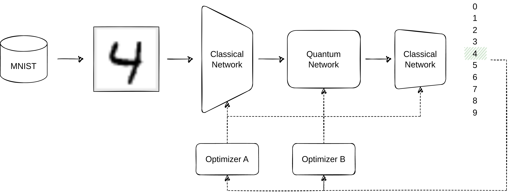

# Split Optimizer

When building hybrid models, a single optimizer is usually handling all parameters ([1], [2], [3]), quantum and classical ones.
This project aims to clarify if there are advantages of having individual optimizers for each part of the hybrid model.

## Approach :pencil:

With the current approach a full-size MNIST sample (28x28) is fed into a classical neural network.
The output of this network is then embedded onto a Variational Quantum Circuit which performs the final classification.



Both parts have individual optimisers, of which the following types are planned to be tested:
- Adam (as a baseline comparison; shouldn't perform much different compared to a single Adam instance)
- SGD (different learning rates)
- NGD / QNG
- SPSA / QNSPSA [4]

Besides the overall performance, the convergence speed should be considered in evaluation.

## Getting Started :rocket:

This project is built using the [Kedro Framework](https://docs.kedro.org).

### Install Dependencies :floppy_disk:

Using pip:
```
pip install -r src/requirements.txt
```

### Running Experiments :running:

Without further configuration you can execute
```
kedro run
```
which will load MNIST, preprocess the data and start training the model.

If want an overview of the nodes and pipelines, you can execute
```
kedro viz
```
which will open Kedro`s dashboard in you browser.


### Configuration :wrench:

The following parameters can be adjusted:
- Data Preprocessing Parameters: `conf/base/parameters/data_processing.yml`
  - Batch size
  - Seed
- Training Parameters: `conf/base/parameters/data_science.yml`
  - Loss function
  - Learning rate
  - Number of epochs
  - Optimizer approach
- Global Parameters: `conf/base/globals.yml`
  - Training/ Test Size
  - Number of classes
  - Number of qubits

## Literature :books:

[1]: [Hybrid Quantum Classical Graph Neural Networks for Particle Track Reconstruction](https://arxiv.org/abs/2109.12636)\
[2]: [Quantum-classical convolutional neural networks in radiological image classification](https://arxiv.org/abs/2204.12390)\
[3]: [Quantum classical hybrid neural networks for continuous variable prediction](https://doi.org/10.48550/arXiv.2212.04209)\
[4]: [Simultaneous Perturbation Stochastic Approximation of the Quantum Fisher Information](https://quantum-journal.org/papers/q-2021-10-20-567/)
